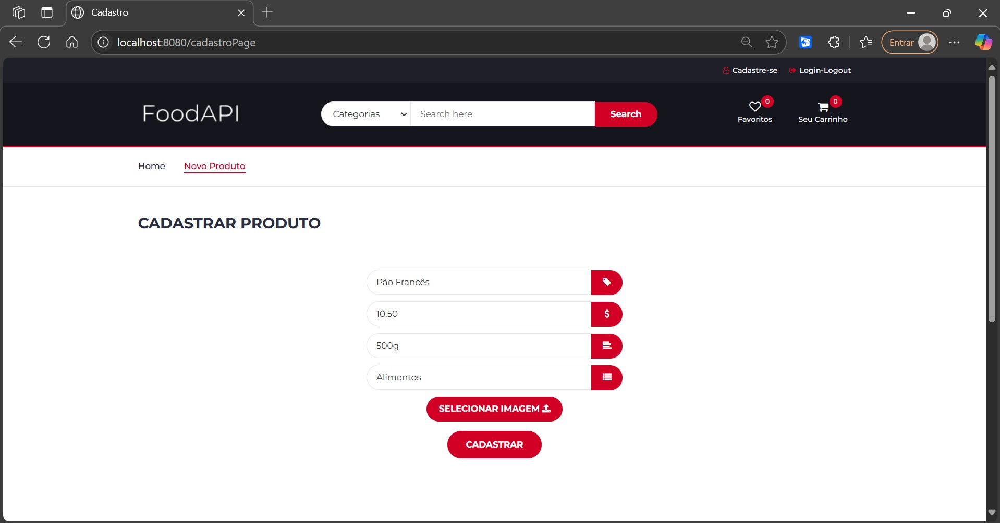
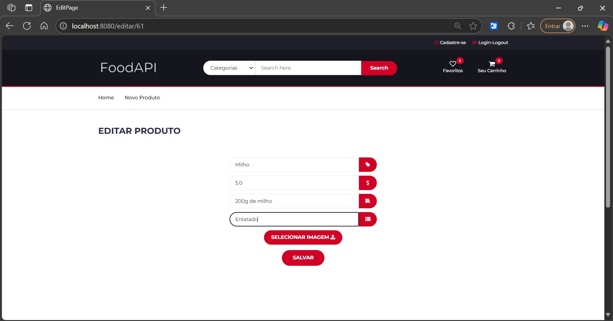
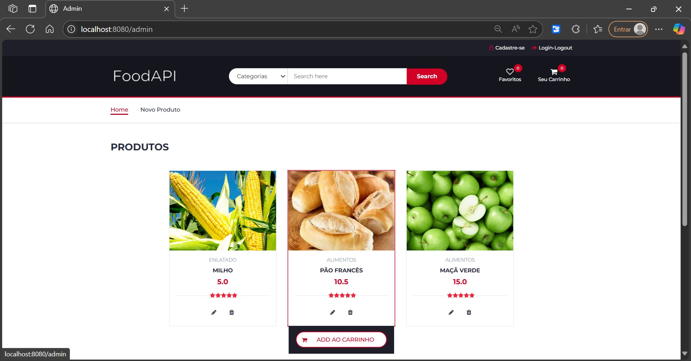
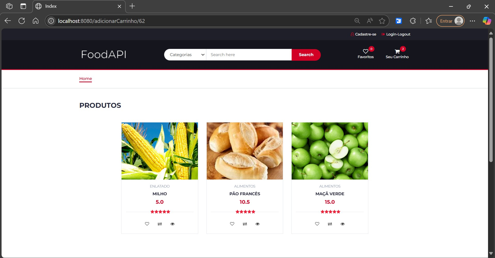
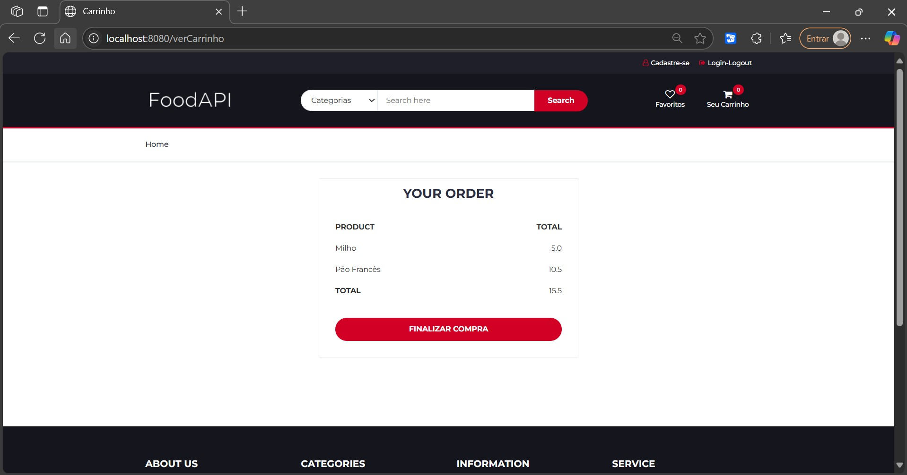

# 🍽️ FoodAPI
Sistema para gerenciamento de produtos alimenticios, com controle de usuários e carrinho de compras. Desenvolvido com **Java**, **Spring Boot** e integração com **Thymeleaf**.

## 📌 Funcionalidades
- 📦 Cadastro, edição e exclusão de produtos.
- 🖼️ Armazenamento de imagens dos produtos.
- 🔐 Cadastro, login e logout de usuários.
- 🛡️ Controle de permissões via **roles** (`ADMIN` e `USER`) para acesso a páginas restritas.
- 🔒 Armazenamento seguro de senhas usando `BCryptPasswordEncoder`.
- 🛒 Carrinho de compras com armazenamento de itens via **cookies** com duração de 24 horas.
- 🌐 Integração entre backend e frontend utilizando **Thymeleaf** para renderização dinâmica das páginas.

  
---
⚠️ **Observação:** O frontend (HTML, CSS e JavaScript) não foi desenvolvido por mim, apenas o adaptei para as minha necessidades e adicionei algumas coisas novas.
Foi baixado de [**Themewagon**](https://themewagon.com/themes/free-bootstrap-ecommerce-template-electro/) e integrado à aplicação utilizando **Thymeleaf** e **Spring Boot**.
---

## 🚀 Tecnologias Utilizadas
- Java 
- Spring Boot
- Spring Security
- Spring Data JPA
- PostgreSQL
- Thymeleaf
- BCryptPasswordEncoder
- HTML, CSS, JavaScript, Bootstrap

## 📷 Demonstrações
### Tela de Cadastro de Produtos

### Tela de Editar Produtos

### Tela de Login

### Tela de Editar Produtos
### Tela inicial: admin

### Tela inicial: user

### Tela do carrinho

## 📖 Como Executar o Projeto

### 🔽 Clonar o repositório:
- Configure o application.properties com sua credenciais do PostgreSQL
- Rode o projeto
- Acesse em http://localhost:8080
